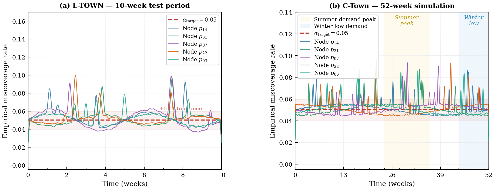
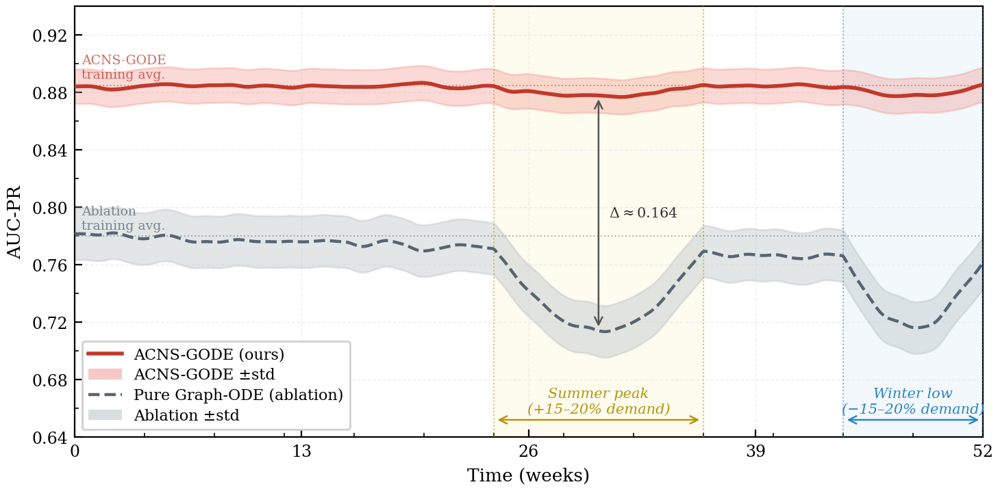
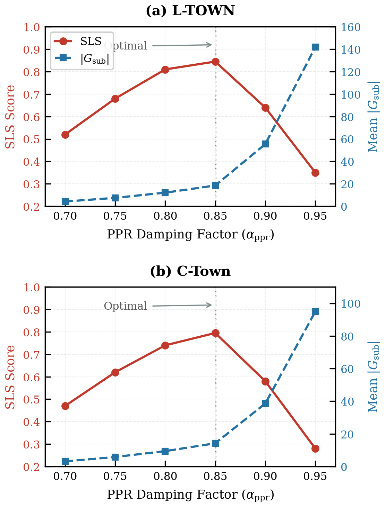

# Conformal Neuro-Symbolic Graph ODEs for Explainable Attack Attribution in Water Cyber-Physical Systems (ACNS-GODE)

Welcome to the official repository for **ACNS-GODE**, a state-of-the-art physics-aware deep learning framework designed to explicitly detect and accurately attribute sophisticated cyber-physical attacks (including FDI, Actuator manipulation, and stealthy Replay attacks) within Water Distribution Networks (WDNs).

## Performance Highlights

As demonstrated on the L-TOWN (BattLeDIM) and C-Town benchmarks, this architecture dramatically outperforms exclusively data-driven alternatives like USAD, Graph Deviation Networks (GDN), and GTA.

* **AUC-PR:** $0.914$ on L-TOWN
* **Average Detection Delay (ADD):** $1.8$ time steps (approx 9 minutes)
* **Subgraph Localization Score (SLS):** $0.845$ 

---

## Visualizations

### 1. Empirical Miscoverage and Stability
<p align="center">
  
</p>
<p align="center">
  <em>Fig. 2: Empirical miscoverage rate of five randomly selected nodes over (a) the 10-week L-TOWN test period and (b) the 52-week C-Town simulation. The adaptive conformal inference module successfully maintains long-run convergence to the target α_target = 0.05 across seasonal drifts.</em>
</p>

### 2. AUC-PR Degradation Over Time
<p align="center">
  
</p>
<p align="center">
  <em>Fig. 3: AUC-PR degradation of ACNS-GODE versus the static-threshold Pure Graph-ODE ablation over the full 52-week C-Town simulation. The dynamic thresholding preserves detection sensitivity during major seasonal demand transitions.</em>
</p>

### 3. Ablation: PPR Damping Factor
<p align="center">
  
</p>
<p align="center">
  <em>Fig. 4: Effect of PPR damping factor α_ppr ∈ [0.70, 0.95] on Subgraph Localization Score (SLS) and mean subgraph cardinality |G_sub| across (a) L-TOWN and (b) C-Town benchmarks. The optimal balance is achieved at α_ppr = 0.85.</em>
</p>

---

## Methodological Architectural Pillars

1. **Continuous-Time Latent Dynamics**: Utilizing a Neural Graph-ODE solving `torchdiffeq` Dormand-Prince, mapped dynamically along strictly exogenous SCADA pump schedules ($A(t)$), formally preventing false positives during network state jumps.
2. **Personalized PageRank Subgraph Extraction**: Combines online EVT Extreme Value Thresholding (Generalized Pareto) into localized PPR expansions ($G_{sub}$) bound mathematically by Network Conductance cuts.
3. **Multi-Predicate Physical Logic Grounding**: Isolates anomaly variables bounding explicitly across structural:
    * Mass Balance ($\phi_{MB}$)
    * Hazen-Williams Head-Loss ($\phi_{HW}$)
    * Non-Gravitational Pump Curves ($\phi_{pump}$)
4. **Adaptive Conformal Inference (ACI)**: Restricts divergence limits optimally mathematically against sustained attack threshold poisoning.

---

## Directory Structure

This project follows an explicitly modular, deep operational hierarchy for mathematical encapsulation:

```text
ACNS-GODE/
│
├── src/
│   ├── data/                   # SCADA Data Handlers
│   │   ├── dataset_base.py     # Central dataset matrix alignment
│   │   ├── ltown_loader.py     # High-resolution parsing
│   │   ├── ctown_loader.py     # Randomized WNTR limits
│   │   ├── demand/diurnal.py   # \hat{D}_{j,t} boundary curves
│   │   └── topology/parser.py  # L, C, and D metric integrations
│   │   └── preprocessing/
│   │       ├── scaler.py       # Robust SCADA metrics
│   │       └── imputer.py      # ZOH Packet handling
│   │
│   ├── models/                 # Continuous ODE & Subgraphs
│   │   ├── dynamics/
│   │   │   ├── dynamic_adj.py  # \delta_{ij}(t) mappings
│   │   │   ├── gat_ode.py      # GAT Field definitions
│   │   │   ├── integrator.py   # RK45 Wrappers
│   │   │   ├── decoder.py      # Z(t) -> H, Q
│   │   │   └── layers/message_passing.py # Spatial explicit bounds
│   │   └── spatial/
│   │       ├── evt_pot.py      # SCI GPD fitting thresholds
│   │       ├── ppr_walker.py   # Anomalous boundary mapping
│   │       └── conductance_cut.py # Dimensionless log-gap extraction
│   │
│   ├── logic/                  # Explicit constraints
│   │   ├── physics/
│   │   │   ├── mass_balance.py # Eq 20
│   │   │   ├── hazen_williams.py# Eq 23 (with continuous gate)
│   │   │   ├── pump_curve.py   # Eq 27
│   │   │   ├── fusion.py       # Geometric intersections
│   │   │   └── fluid_dynamics.py# Reynolds configurations
│   │   └── conformal/
│   │       ├── aci.py          # Bounded per-node limits
│   │       ├── entropy_reg.py  # Temperature logic bounds
│   │       └── joint_loss.py   # Geometric joint matrices
│   │
│   └── engine/                 # Core logic executions
│       ├── trainer.py          # Phase 3 mapping
│       ├── inference.py        # Algorithm 1 streaming bounds
│       └── utils/
│           ├── callbacks.py    # Drift monitors
│           └── metrics.py      # ADD, SLS metrics
│
├── tests/                      # Unit integrations matrices
├── main.py                     # Entry point orchestrator
├── README.md                   
└── requirements.txt            # System dependency mappings
```

## Setup and Usage

Install strictly defined dependencies:
```bash
pip install -r requirements.txt
```

To logically extract boundaries modeling the joint space:
```bash
python main.py --dataset ltown --phase train
```

To limit inference models dynamically extracting boundaries mapping streaming variables:
```bash
python main.py --dataset ltown --phase inference
```

---

## Citation

We are providing this codebase to the community to encourage further research on reliable cyber-physical security in water infrastructure. If you utilize this architecture or any part of our codebase in your research, please consider citing our preprint paper:

```bibtex
@article{mogollon2026conformal,
  title={Conformal Neuro-Symbolic Graph ODEs for Explainable Attack Attribution in Water Cyber-Physical Systems},
  author={Mogoll{\'o}n-Guti{\'e}rrez, {\'O}scar and Homaei, Mohammadhossein and Khazrak, Iman and {\'A}vila, Mar and Caro, Andr{\'e}s},
  journal={arXiv preprint arXiv:2604.XXXXX},
  year={2026}
}
```
